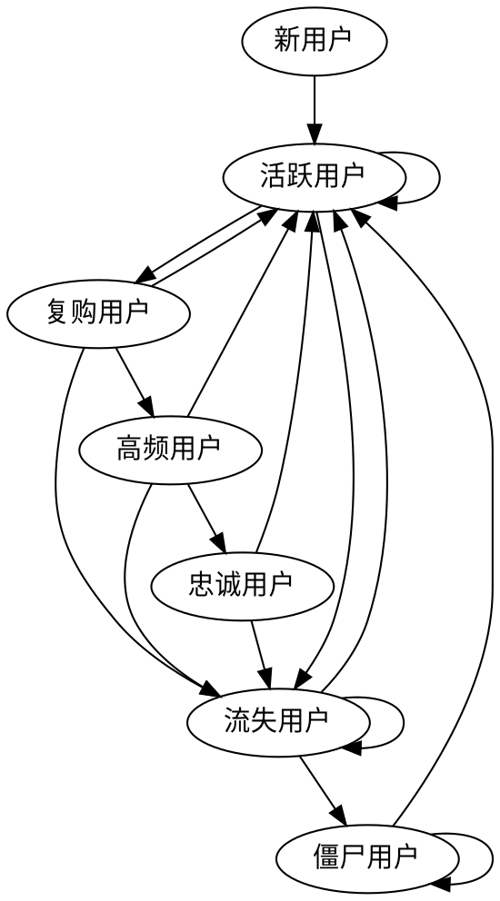

## 新进用户
* **新用户**： 接收到UCS MQ就对新用户打tag

* **活跃用户**： 现有tag是 新用户/流失用户/僵尸用户，订单MQ进入，替换tag为 活跃用户

```上个周期活跃用户？```

* **复购用户**： 现有tag是 活跃用户，订单MQ进入，替换tag为 复购用户

* **高频用户**： 现有tag是 复购用户，订单MQ进入，从cts.order表查该用户
[now-1*period, now]订单量：<5不处理，>=5则替换tag为 高频用户

* **忠诚用户**： 现有tag是 高频用户，从cts.order表查该用户[now-2*period, now-1*period]订单量、[now-3*period, now-2*period]订单量：
两次订单量都>=5：忠诚用户，其他情况不处理

* **流失用户**： 扫描具有活跃、复购、高频、忠诚tag且tagTime<now - 1*period的用户，替换tag为 流失用户

* **僵尸用户**： 扫描具有流失tag且tagTime<now - 3*period的用户，替换tag为 僵尸用户


## 现有用户

* **新用户**： 映射已有的柜机新用户标签

* **活跃用户**： 映射已有的柜机老用户标签

* **复购用户**： 

* **高频用户**： 

* **忠诚用户**： 

* **流失用户**：

* **僵尸用户**： 